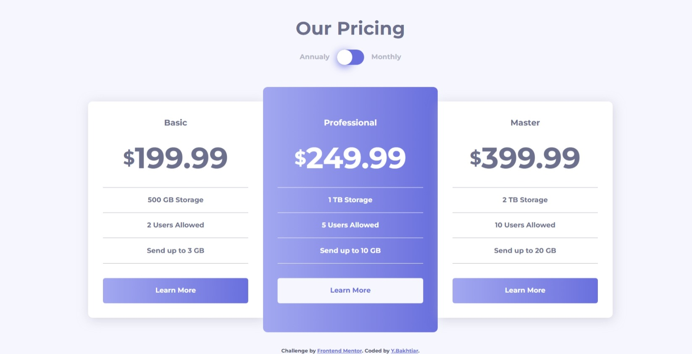

# Frontend Mentor - Pricing component with toggle solution

This is a solution to the [Pricing component with toggle challenge on Frontend Mentor](https://www.frontendmentor.io/challenges/pricing-component-with-toggle-8vPwRMIC). Frontend Mentor challenges help you improve your coding skills by building realistic projects. 

## Table of contents

- [Overview](#overview)
  - [The challenge](#the-challenge)
  - [Screenshot](#screenshot)
  - [Links](#links)
- [My process](#my-process)
  - [Built with](#built-with)
  - [What I learned](#what-i-learned)
  - [Useful resources](#useful-resources)
- [Author](#author)

## Overview

### The challenge

Users should be able to:

- View the optimal layout for the component depending on their device's screen size
- Control the toggle with both their mouse/trackpad and their keyboard
- **Bonus**: Complete the challenge with just HTML and CSS

### Screenshot

### Links

- Solution URL: [Add solution URL here](https://your-solution-url.com)
- Live Site URL: [Add live site URL here](https://your-live-site-url.com)

## My process

### Built with

- Semantic HTML5 markup
- CSS custom properties
- Flexbox
- CSS Grid
- Mobile-first workflow

### What I learned

- Utilizing functional :has() to target specific state and element so the payment switch could dynamicly shows the annual/monthly price, without javascript needed.

- Trying to keep custom switch accessible using :focus pseudoclass

### Useful resources

- Switch toggle inspired by [gharsh11032000 on uiverse.io](https://uiverse.io/gharsh11032000/green-liger-89) - its simple and looks great.
- Explanation of :has() pseudo class on [MDN](https://developer.mozilla.org/en-US/docs/Web/CSS/:has) - The functional pseudo class used to switch annual/monthly price visibility.

## Author

- Github - [b4khtiar](https://github.com/b4khtiar)
- Frontend Mentor - [@b4khtiar](https://www.frontendmentor.io/profile/b4khtiar)
